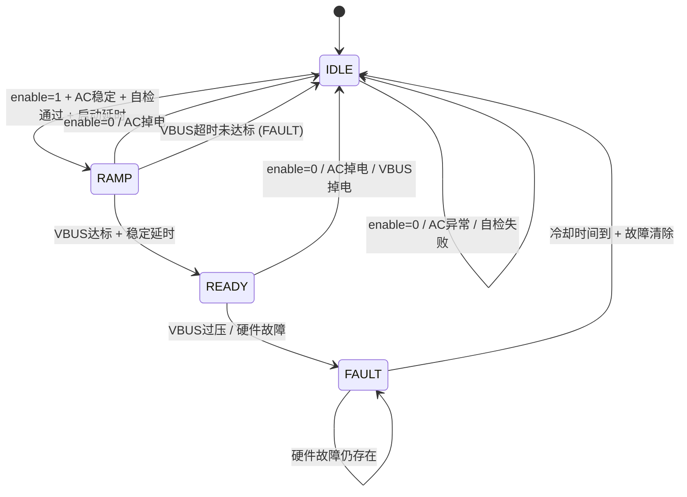
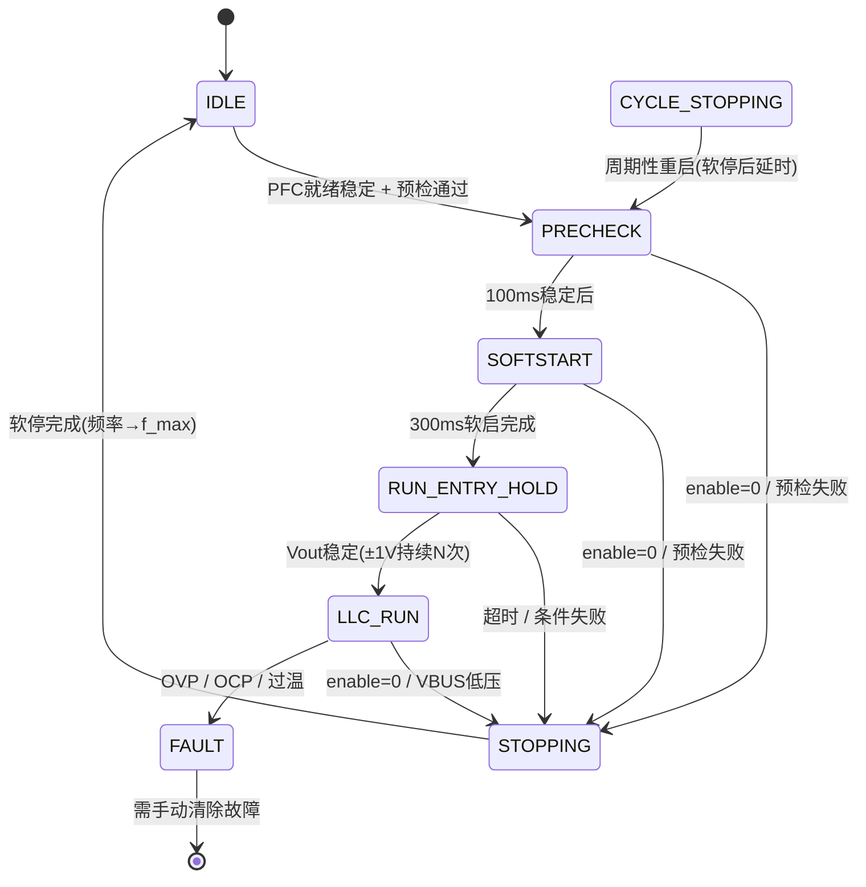

# OBC项目架构明细
**版本：** v1.0  
**日期：** 2026-04-27  
**平台：** GD32F30x @ 108MHz  
**功率级：** 6.6kW (PFC 6600W + LLC 48V/40A)

---

## 1. 系统架构概览

### 1.1 硬件拓扑

```
[AC Input] → [PFC (图腾柱无桥)] → [400V BUS] → [LLC谐振变换器] → [48V Output]
                    ↓                                    ↓
              [NCP1654控制]                      [GD32 PWM控制]
                    ↓                                    ↓
              [MCU GPIO/ADC] ←→ [采样/保护] ←→ [MCU Timer/PWM]
```

### 1.2 软件分层架构

```
┌─────────────────────────────────────────────────────────┐
│                  应用层 (Application)                   │
│  charge_ctrl.c (充电流程) / temp_control.c (温度管理)  │
└─────────────────────────────────────────────────────────┘
                            ↓
┌─────────────────────────────────────────────────────────┐
│                控制层 (Control 1kHz/100us)              │
│  pfc_control.c (PFC状态机) / llc_control.c (LLC状态机)│
│  LLC_soft_start.c (软启/软停) / llc_close_loop (闭环)  │
└─────────────────────────────────────────────────────────┘
                            ↓
┌─────────────────────────────────────────────────────────┐
│              硬件抽象层 (HAL - HW文件夹)                 │
│  pwm_llc.c (LLC PWM) / pwm.c (BUS_ADJ PWM)            │
│  adc_dma.c (多通道ADC+DMA) / Timer.c (定时触发)        │
│  protect_exti.c (硬件保护中断) / aux_power.c (辅助电源) │
└─────────────────────────────────────────────────────────┘
                            ↓
┌─────────────────────────────────────────────────────────┐
│                  芯片外设 (GD32F30x)                    │
│  TIMER0(LLC PWM) / TIMER3(100us触发) / SysTick(1ms)  │
│  ADC0/ADC1/ADC2 (多通道采样) / DMA0 (自动传输)         │
│  EXTI (硬件保护BKIN) / GPIO (继电器/使能)              │
└─────────────────────────────────────────────────────────┘
```

---

## 2. 组件明细与职责

### 2.1 PFC控制模块 (`pfc_control.c/h`)

| 属性 | 说明 |
|------|------|
| **职责** | 功率因数校正控制，管理PFC状态机 |
| **依赖** | `pwm.c` (BUS_ADJ PWM), `protect_exti.c`, `adc_dma.c` |
| **调用者** | `main.c` (1kHz循环) |

**状态机：**
```
IDLE → RAMP → READY → (故障) → FAULT
           ↑                    ↓
           └────────────────────┘
```

### 2.2 LLC控制模块 (`llc_control.c/h`)

| 属性 | 说明 |
|------|------|
| **职责** | LLC谐振变换器控制，双环(CV/CC)控制 |
| **依赖** | `pwm_llc.c`, `LLC_soft_start.c`, `adc_dma.c`, `pfc_control.c` |
| **调用者** | `main.c` (1kHz主循环 + 100us快循环) |

**状态机：**
```
IDLE → PRECHECK → SOFTSTART → RUN_ENTRY_HOLD → LLC_RUN → STOPPING → IDLE
                                ↓                ↓
                            (故障)           (母线低压)
                              FAULT ←────────────┘
```

### 2.3 ADC采样模块 (`adc_dma.c/h`)

| 属性 | 说明 |
|------|------|
| **职责** | 多通道ADC采样 + DMA传输，触发方式：TIMER3 100us |
| **关键通道** | VOUT (PA0), ISENSE (PA1), VBUS (PA3), VAC (PA2) |
| **数据更新** | 100us更新一次原始数据，1kHz读取滤波值 |

### 2.4 PWM模块

| 模块 | 定时器 | 频率 | 用途 |
|------|--------|------|------|
| `pwm_llc.c` | TIMER0 (高级) | 75k-250kHz | LLC半桥PWM，带死区，BKIN保护 |
| `pwm.c` | TIMERx | ~1kHz | BUS_ADJ PWM (控制NCP1654电压设定) |

### 2.5 保护模块 (`protect_exti.c/h`)

| 类型 | 触发方式 | 响应 |
|------|----------|------|
| 硬件保护 (BKIN) | 比较器 → EXTI | 立即关PWM (硬件级) |
| 软件保护 | ADC采样判断 | 状态机进入FAULT |

---

## 3. 时序流程图

### 3.1 上电启动时序

```
系统上电
   ↓
初始化 (RCU/GPIO/ADC/PWM/NVIC/SysTick)
   ↓
ADC自检测 (采样3.3V基准 + VOUT/ISENSE)
   ↓
保护检查 (BKIN是否高? 无锁存故障?)
   ↓
初始化PFC/LLC/充电控制
   ↓
用户使能 (pfc_enable())
   ↓
┌─────────────────────────────────────┐
│ PFC启动流程 (1kHz tick驱动)        │
│ IDLE → 检测AC有效(去抖) → RAMP    │
│   → 继电器吸合 → VBUS爬坡 → READY │
└─────────────────────────────────────┘
   ↓
等待PFC稳定 (PFC_READY_STABLE_MS = 200ms)
   ↓
┌─────────────────────────────────────┐
│ LLC启动流程 (1kHz/100us tick驱动)  │
│ IDLE → PRECHECK(100ms)             │
│   → SOFTSTART(200k→130kHz, 300ms) │
│   → RUN_ENTRY_HOLD(稳定)           │
│   → LLC_RUN (闭环CV/CC)            │
└─────────────────────────────────────┘
   ↓
正常运行 (充电中)
   ↓
检测到故障/用户撤除使能
   ↓
┌─────────────────────────────────────┐
│ 停机流程                            │
│ LLC: 软停 (频率升到f_max, 300ms)  │
│   → PWM关闭 → 驱动关闭              │
│ PFC: 撤除使能 → 继电器断开        │
└─────────────────────────────────────┘
```

### 3.2 PFC状态机详细流程 (1kHz)



### 3.3 LLC状态机详细流程 (1kHz + 100us)



### 3.4 控制循环时序 (时间轴)

```
时间轴 (ms):  0    1    2    3    ...   300   301  ...  1000  1001 ...
              ├───┼───┼───┼───┼───┼────┼────┼──┼────┼────┼───→
1kHz tick:    │   │   │   │   │    │    │   │    │    │
              ▼   ▼   ▼   ▼   ▼    ▼    ▼   ▼    ▼    ▼
           [PFC tick] [PFC tick] ... [LLC tick 1kHz] ...
                              │
                              ▼
                        100us tick (TIMER3 IRQ)
                              │
                              ▼
                        [ADC采样触发]
                              │
                              ▼
                        [LLC快环: 电压滤波 + PI]
                              │
                              ▼
                        [每5次(500us): 电流环 + 电压环]

时间轴 (启动阶段):
0ms:    PFC使能 → 继电器吸合
800ms:   PFC READY (VBUS≥380V)
1000ms:  LLC开始软启 (200kHz→130kHz)
1300ms:  软启完成 → RUN_ENTRY_HOLD
1500ms:  进入LLC_RUN → 闭环控制 (44V CV)
```

---

## 4. 组件接口设计

### 4.1 PFC控制接口 (`pfc_control.h`)

| 函数 | 参数 | 返回 | 说明 |
|------|------|------|------|
| `pfc_init()` | void | void | 初始化PFC状态机，关闭输出 |
| `pfc_enable()` | void | void | 使能PFC，开始启动流程 |
| `pfc_disable()` | void | void | 禁用PFC，立即回IDLE |
| `pfc_tick_1khz()` | void | void | 1kHz状态机驱动 |
| `pfc_get_vbus()` | void | float | 获取当前VBUS电压(V) |
| `pfc_get_vac()` | void | float | 获取AC电压有效值(V) |
| `pfc_is_ready()` | void | bool | PFC是否READY (可启动LLC) |
| `pfc_is_fault()` | void | bool | PFC是否故障 |
| `pfc_clear_fault()` | void | void | 清除故障锁存 (需满足条件) |

**内部状态枚举：**
```c
typedef enum {
    PFC_ST_IDLE = 0,
    PFC_ST_RAMP,
    PFC_ST_READY,
    PFC_ST_FAULT
} pfc_state_t;
```

### 4.2 LLC控制接口 (`llc_control.h`)

| 函数 | 参数 | 返回 | 说明 |
|------|------|------|------|
| `llc_app_init()` | void | void | 初始化LLC状态机、软启、PI参数 |
| `llc_app_tick_1khz()` | void | void | 1kHz状态机驱动 |
| `llc_app_tick_100us()` | void | void | 100us快环: 采样+电压PI |
| `llc_set_vref(float v)` | vref (V) | void | 设置输出电压参考值 |
| `llc_set_iref(float i)` | iref (A) | void | 设置输出电流参考值 |
| `llc_set_run_request(bool)` | en | void | 设置LLC运行请求 |
| `llc_get_vref()` | void | float | 获取当前Vref |
| `llc_get_iref()` | void | float | 获取当前Iref |
| `llc_app_state()` | void | llc_state_t | 获取当前状态 |
| `llc_is_fault_state()` | void | bool | 是否故障状态 |

**状态枚举：**
```c
typedef enum {
    ST_IDLE = 0,
    ST_PRECHECK,
    ST_SOFTSTART,
    ST_RUN_ENTRY_HOLD,
    ST_LLC_RUN,
    ST_STOPPING,
    ST_CYCLE_STOPPING,
    ST_FAULT
} llc_state_t;
```

### 4.3 软启/软停接口 (`LLC_soft_start.h`)

| 函数 | 参数 | 返回 | 说明 |
|------|------|------|------|
| `llc_softstart_init()` | void | void | 初始化软启上下文 |
| `llc_softstart_start(float)` | target_hz | void | 开始软启到目标频率 |
| `llc_softstart_stop()` | void | void | 停止软启 (保留当前频率) |
| `llc_softstart_tick_1khz()` | void | void | 1kHz推进软启进度 |
| `llc_softstart_last_hz()` | void | float | 获取软启结束频率 |
| `llc_softstop_start(float)` | start_freq | void | 开始软停 (升频) |
| `llc_softstop_tick_1khz()` | void | void | 1kHz推进软停 |
| `llc_softstop_is_done()` | void | bool | 软停是否完成 |

### 4.4 ADC接口 (`adc_dma.h`)

| 函数 | 参数 | 返回 | 说明 |
|------|------|------|------|
| `adc_multi_init_dma()` | trigger | void | 初始化多通道ADC+DMA |
| `adc_multi_start()` | void | void | 启动ADC连续转换 |
| `adc_multi_copy()` | void | void | 复制DMA数据到全局结构 |
| `adc_multi_trigger_fast()` | void | void | 软件触发一次ADC |
| `adc_multi_sample_aux_1khz()` | void | void | 1kHz辅助采样 |

**全局数据：**
```c
typedef struct {
    uint16_t vout_raw;    // PA0 输出电压
    uint16_t isense_raw;   // PA1 输出电流
    uint16_t vbus_raw;     // PA3 母线电压
    uint16_t vac_raw;      // PA2 交流电压
} adc_multi_t;
extern adc_multi_t g_adc_multi;
```

### 4.5 PWM接口

**LLC PWM (`pwm_llc.h`):**
| 函数 | 参数 | 返回 | 说明 |
|------|------|------|------|
| `llc_pwm_init(cfg)` | llc_pwm_cfg_t* | void | 初始化TIMER0互补PWM |
| `llc_pwm_set_freq(hz, force)` | hz, bool | void | 设置频率 (更新ARR) |
| `llc_pwm_set_duty(duty)` | 0.0-1.0 | void | 设置占空比 (通常0.5) |
| `llc_pwm_outputs_enable(en)` | bool | void | 使能/禁用PWM输出 |

**BUS_ADJ PWM (`pwm.h`):**
| 函数 | 参数 | 返回 | 说明 |
|------|------|------|------|
| `bus_vol_adj_init()` | void | void | 初始化PB0 PWM |
| `pb0_pwm_set_duty(duty)` | 0.0-1.0 | void | 设置BUS_ADJ占空比 |

### 4.6 保护接口 (`protect_exti.h`)

| 函数 | 参数 | 返回 | 说明 |
|------|------|------|------|
| `protect_exti_init()` | void | void | 初始化PC11 BKIN中断 |
| `protect_fault_active_hw()` | void | bool | 硬件故障是否正在发生 |
| `protect_fault_latched()` | void | bool | 软件锁存故障是否存在 |
| `protect_clear_fault()` | void | void | 清除软件故障锁存 |

---

## 5. 关键数据流

```
               ┌──────────────┐
               │   ADC采样     │ (100us/次 via TIMER3)
               │ VOUT/ISENSE  │
               │ VBUS/VAC     │
               └──────┬───────┘
                      ↓
        ┌─────────────────────────────┐
        │  1kHz主循环 (main.c)        │
        │  pfc_tick_1khz()            │ → 更新PFC状态机
        │  llc_app_tick_1khz()        │ → 更新LLC状态机
        │  charge_ctrl_tick_1khz()     │ → 充电逻辑
        └─────────────────────────────┘
                      ↓
        ┌─────────────────────────────┐
        │  100us快循环 (TIMER3 IRQ)   │
        │  adc_multi_copy()            │ → 刷新采样数据
        │  llc_app_tick_100us()        │ → 电压滤波 + PI
        │    → 每5次(500us):           │
        │      电流环(llc_current_...)  │
        │      电压环(llc_ctrl_step)    │
        │      → llc_set_freq()        │ → 更新PWM频率
        └─────────────────────────────┘
                      ↓
        ┌─────────────────────────────┐
        │  PWM输出 (TIMER0)            │
        │  LLC_H / LLC_L (互补)        │ → 驱动LLC半桥
        │  死区时间 = LLC_PWM_DEAD_NS  │
        └─────────────────────────────┘
```

---

## 6. 关键配置宏

### 6.1 PFC配置 (`pfc_control.h`)

```c
#define PFC_AC_VALID_MIN_VRMS    85.0f   // AC最低有效电压
#define PFC_AC_VALID_MAX_VRMS    265.0f  // AC最高有效电压
#define PFC_VBUS_ENABLED_MIN_V  380.0f   // VBUS就绪最低电压
#define PFC_VBUS_ENABLED_MAX_V  410.0f   // VBUS就绪最高电压
#define PFC_VBUS_OVP_V          430.0f   // VBUS过压保护
#define PFC_STARTUP_DELAY_MS    500U     // 启动延时
#define PFC_VBUS_RAMP_TIMEOUT_MS 800U    // 爬坡超时
#define PFC_READY_DELAY_MS      200U     // READY稳定延时
```

### 6.2 LLC配置 (`llc_control.h`)

```c
#define LLC_VOUT_TARGET_V       44.0f    // 输出电压目标
#define LLC_VOUT_OVP_V         48.0f    // 输出过压保护
#define LLC_IOUT_TARGET_A       40.0f    // 输出电流目标
#define LLC_IOUT_OCP_A          41.0f    // 输出过流保护
#define LLC_F_MIN_HZ           75000.0f  // 最低频率
#define LLC_F_MAX_HZ          250000.0f  // 最高频率
#define LLC_SOFTSTART_START_HZ 200000.0f // 软启起始频率
#define LLC_SOFTSTART_TARGET_HZ 91000.0f // 软启目标频率 (谐振点≈91kHz)
#define LLC_SOFTSTART_DURATION_MS 300U  // 软启持续时间
#define LLC_F_NOM_HZ           91000.0f  // 标称频率(谐振点)
```

---

## 7. 调试建议

1. **先开环后闭环**：LLC先跑开环扫频，确认fr≈91kHz
2. **单步验证**：每个状态切换用LED或串口打印
3. **保护测试**：BKIN引脚手动拉低，验证硬件关断
4. **电流环验证**：先设大Iref(999A)，只跑电压环；再逐步降低Iref测试限流

---

*文档生成时间: 2026-04-27 19:20*
